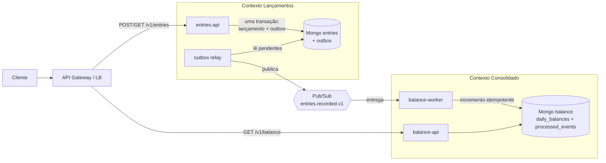

# Fluxo de caixa: lançamentos e consolidado diário

Desafio de Arquiteto de Soluções. O comerciante registra débitos e créditos do dia e consulta o saldo diário consolidado.

O enunciado tem uma frase que define a arquitetura: "o serviço de controle de lançamento não deve ficar indisponível se o sistema de consolidado diário cair". Isso descarta qualquer desenho em que o lançamento chame o consolidado de forma síncrona. O resto decorre daí: dois serviços, comunicação por evento, e o consolidado como uma projeção de leitura que pode atrasar ou parar sem travar a venda.

A carga pedida é de 50 req/s de pico no consolidado, com até 5% de perda. É pouco, cabe em duas instâncias pequenas, e procurei não dimensionar nada acima disso.

Documentos:

* [Decisões](docs/decisoes.md): por que cada escolha, o que descartei, e a arquitetura de transição a partir de um legado.
* [Operação](docs/operacao.md): segurança no consumo das APIs, observabilidade, SLOs e custos.

## Domínio e capacidades

O domínio core é Gestão de Fluxo de Caixa. Identidade e observabilidade são genéricos: resolvo com produto de mercado.

Dentro do core há dois bounded contexts. A fronteira entre eles existe porque têm requisitos de disponibilidade diferentes:

| Contexto | Responsabilidade | Capacidades |
|---|---|---|
| Lançamentos (`entries`, upstream) | Registrar o fato financeiro | Registrar crédito, registrar débito, garantir não-duplicidade, consultar lançamentos do dia |
| Consolidado Diário (`balance`, downstream) | Derivar e servir o saldo | Consolidar saldo por dia, relatório por período, reprocessar via replay |

A relação é Customer/Supplier com Published Language. Lançamentos publica `EntryRecorded v1`, o Consolidado consome. Nenhum dos dois conhece o modelo interno do outro e não existe chamada síncrona entre eles. É o acoplamento mínimo que atende ao requisito de disponibilidade, e é o que permite plugar conciliação, fiscal ou BI depois sem tocar em Lançamentos.

Vocabulário do domínio. O código e a API são escritos em inglês, então cada termo tem um nome só, dos dois lados:

| Termo | No código e na API | Definição |
|---|---|---|
| Lançamento | `Entry` | Registro imutável de uma movimentação. Não se edita nem se apaga, corrige-se com um lançamento de sentido oposto |
| Comerciante | `merchant` | Titular do caixa, identificado pelo `sub` do token |
| Data de negócio | `entryDate` / `businessDate` | O dia no fuso do comerciante (`America/Sao_Paulo`), não em UTC. Uma venda às 22h de São Paulo é do dia 16, não do 17 |
| Saldo diário consolidado | `DailyBalance` | Créditos menos débitos de uma data de negócio, por comerciante |
| Crédito e débito | `CREDIT` / `DEBIT` | Entrada e saída de caixa |

## Requisitos

Funcionais:

1. Registrar um lançamento (tipo, valor, descrição opcional, data opcional). Valor é inteiro positivo em centavos.
2. Não duplicar lançamento em reenvio. O cliente manda `Idempotency-Key` e o replay devolve o mesmo recurso.
3. Aceitar lançamento retroativo até 30 dias, recusar data futura.
4. Consultar os lançamentos de um dia, paginados.
5. Consultar o saldo de um dia ou de um período de até 31 dias, com dias sem movimento zerados.
6. Isolar dados por comerciante. O identificador vem do token, nunca do corpo ou da query.

Não funcionais:

| Requisito | Meta | Como verifico |
|---|---|---|
| Lançamentos sobrevive à queda do consolidado | 100% das escritas aceitas | Derrubar o consolidado e a mensageria e continuar postando |
| Capacidade do consolidado | 50 req/s, erro < 5%, p95 < 200 ms | Teste k6 em `tests/load` |
| Latência de propagação | saldo reflete o lançamento em < 2s (p95) | Teste ponta a ponta |
| Consistência do saldo | nenhum evento contado duas vezes | Testes de idempotência e comutatividade |
| Disponibilidade de escrita | 99,9% | SLO em [docs/operacao.md](docs/operacao.md) |

A consistência do relatório é eventual. Entre "o comerciante não consegue registrar a venda" e "o relatório demora um segundo para atualizar", o segundo é bem melhor.

## Arquitetura



Não existe seta entre os dois contextos. Todo o acoplamento está no contrato do evento.

**Escrita.** A API valida o token, aplica as regras de domínio e grava o lançamento e a mensagem de saída na mesma transação do MongoDB. Só então responde 201. O cliente não espera pela mensageria.

Isso resolve o dual write. Se eu gravasse no banco e publicasse depois, uma falha entre as duas operações deixaria o saldo errado para sempre, sem erro em lugar nenhum. Com o outbox, ou as duas coisas acontecem ou nenhuma. O relay é um processo separado que lê os pendentes e publica. Com o Pub/Sub fora, os eventos acumulam e saem quando ele voltar.

**Leitura.** O worker consome a subscription e aplica o incremento no saldo do dia. A entrega do Pub/Sub é at-least-once, então o mesmo evento pode chegar duas vezes, e chega mesmo: basta um `ack` se perder. O worker grava o `eventId` e faz o `$inc` na mesma transação, e ignora o que já foi aplicado. Sem isso, uma reentrega corrompe o saldo em silêncio.

Outbox mais consumidor idempotente dá o efeito de "exatamente uma vez" sem depender de garantia especial da infraestrutura.

**Por que o saldo é contador e não soma.** O consolidado guarda um documento por `(merchantId, date)` e aplica `$inc`. Somar os lançamentos na hora da consulta deixaria a leitura proporcional ao volume do dia, e é a leitura que tem o pico de 50 req/s. Consolidando na escrita, a consulta vira um lookup por chave primária.

O efeito prático é que a consulta custa o mesmo com mil ou com um milhão de lançamentos: ela lê no máximo 31 documentos, um por dia do intervalo, e soma esses 31. Volume de transação não entra no caminho de leitura em nenhum ponto.

Onde o volume aparece é na escrita. Lançamentos de um mesmo comerciante no mesmo dia disputam o mesmo documento, então o limite do desenho é contenção de documento quente, não tamanho de intervalo. Medindo aqui, 100 escritas concorrentes no mesmo documento levaram cerca de 600 ms com o resultado correto, o que dá folga confortável para o volume do enunciado. Se um comerciante grande passasse a concentrar picos, a saída é fatiar o contador (vários documentos por dia somados na leitura) antes de pensar em sharding.

**Modos de execução.** Cada serviço é um deployable só, e a variável `MODE` define o papel do processo (`api`, `relay`/`worker`, ou `all`). Local sobe tudo junto. Na nuvem cada papel vira um serviço com sua política de escala, sem precisar manter quatro repositórios.

Contrato do evento:

```json
{
  "eventId": "uuidv7",
  "eventType": "EntryRecorded",
  "eventVersion": 1,
  "occurredAt": "2026-09-16T18:20:31.482Z",
  "data": {
    "entryId": "uuidv7",
    "merchantId": "merchant-demo",
    "type": "CREDIT",
    "amountCents": 15000,
    "entryDate": "2026-09-16"
  }
}
```

A mensagem leva `merchantId:entryDate` como atributo. Não é chave de ordenação: aplicar o delta é soma, é comutativa, e tem teste provando que a ordem de chegada não muda o resultado. O atributo existe porque facilita rastrear um evento travado.

## Como rodar

Precisa de Docker com Compose v2. Node 22 só para gerar token e rodar os testes.

```bash
docker compose up -d --build
docker compose ps    # espere lancamentos e consolidado ficarem healthy
```

Sobe o MongoDB como replica set de um nó (transação exige replica set, mesmo local) e o emulador oficial do Pub/Sub, cria o tópico e a subscription, e sobe `entries` em `localhost:3000` e `balance` em `localhost:3001`.

Demo ponta a ponta, que registra lançamentos, repete um para mostrar a idempotência e consulta o saldo:

```bash
./scripts/demo.sh
```

Na mão:

```bash
TOKEN=$(node scripts/generate-token.mjs merchant-demo)

curl -X POST http://localhost:3000/v1/entries \
  -H "Authorization: Bearer $TOKEN" -H 'Content-Type: application/json' \
  -H 'Idempotency-Key: sale-000123' \
  -d '{"type":"CREDIT","amountCents":15000,"description":"Venda balcao"}'

curl "http://localhost:3001/v1/balance/daily?date=$(date +%F)" \
  -H "Authorization: Bearer $TOKEN"
```

### API

| Método | Rota | Escopo | Observações |
|---|---|---|---|
| POST | `/v1/entries` | `entries:write` | `type` (`CREDIT`/`DEBIT`), `amountCents` (inteiro > 0), `description?` (≤ 140), `entryDate?` (`YYYY-MM-DD`). Header `Idempotency-Key` opcional. 201, ou 200 no replay |
| GET | `/v1/entries?date=&limit=&cursor=` | `entries:read` | Lançamentos do dia, paginação por cursor |
| GET | `/v1/entries/{id}` | `entries:read` | |
| GET | `/v1/balance/daily?date=` ou `?from=&to=` | `balance:read` | Intervalo de até 31 dias |
| GET | `/health/live`, `/health/ready`, `/metrics` | | Probes e métricas Prometheus |

Valores monetários são sempre inteiros em centavos. R$ 150,00 vira `15000`, nunca float.

Erros seguem RFC 9457 (`application/problem+json`): 400 para formato, 401 e 403 para autenticação e escopo, 404, 422 para regra de negócio (com um `code` estável que o cliente pode tratar) e 5xx.

O token local é HS256 com segredo compartilhado, gerado pelo script, só para exercitar a API sem subir provedor de identidade. Em produção seria RS256 contra o JWKS do provedor, detalhado em [docs/operacao.md](docs/operacao.md).

### Variáveis de ambiente

| Variável | Padrão | Serviço |
|---|---|---|
| `PORT` | 3000 / 3001 | ambos |
| `MODE` | `all` | entries: `api`/`relay`/`all`; balance: `api`/`worker`/`all` |
| `MONGO_URI`, `MONGO_DB` | `mongodb://localhost:27017/?replicaSet=rs0`, nome do serviço | ambos |
| `GOOGLE_CLOUD_PROJECT`, `PUBSUB_TOPIC` | `cashflow-local`, `entries.recorded.v1` | ambos |
| `PUBSUB_EMULATOR_HOST` | definido pelo compose | ambos |
| `PUBSUB_SUBSCRIPTION`, `PUBSUB_MAX_CONCURRENT` | `daily-balance`, `50` | balance |
| `RELAY_INTERVAL_MS`, `RELAY_BATCH_SIZE` | `500`, `100` | entries |
| `MAX_RANGE_DAYS` | `31` | balance |
| `JWT_SECRET`, `JWT_ISSUER`, `JWT_AUDIENCE` | valores de dev | ambos |
| `BUSINESS_TZ` | `America/Sao_Paulo` | entries |

## Testes

```bash
cd services/entries   # ou services/balance
npm ci
npm test                  # unitários e de API, sem dependência externa
npm run test:integration  # sobe um Mongo replica set em memória
```

São 53 testes rápidos e 4 de integração. Não fui atrás de percentual de cobertura, priorizei o que quebra em sistema distribuído:

* Domínio: valor, tipo, data futura, janela retroativa, fuso na virada do dia.
* Idempotência: replay com a mesma chave, duas requisições concorrentes com a mesma chave, evento duplicado no consumidor.
* Resiliência: mensageria fora e lançamentos continuam; Mongo fora e a mensagem volta com `nack`; evento malformado não trava a subscription.
* Consolidação: soma correta, independência da ordem de chegada, intervalo com dias vazios.
* Integração com Mongo real: atomicidade de lançamento mais outbox, lock concorrente do relay, `$inc` concorrente.

O teste de integração pegou um bug que o unitário não pegava. O consolidado marcava o evento processado com `insertOne` e capturava erro de chave duplicada para detectar replay. Contra o repositório em memória funciona; contra Mongo real não, porque erro de escrita dentro de transação aborta a transação no servidor, e o evento repetido nunca commitava. Troquei por `upsert` olhando `upsertedCount`.

### Carga

```bash
TOKEN=$(node scripts/generate-token.mjs merchant-demo) k6 run tests/load/balance-50rps.js
```

Sustenta os 50 req/s no consolidado, com rampa até 100 req/s, enquanto 20 req/s de escrita rodam em paralelo, para mostrar que uma coisa não degrada a outra. Os thresholds reprovam se a perda passar de 5% ou o p95 passar de 200 ms.

### Requisito de disponibilidade

```bash
docker compose stop balance
./scripts/demo.sh              # lançamentos seguem retornando 201
docker compose start balance   # consome o backlog e o saldo se acerta
```

Vale repetir com `docker compose stop pubsub`. As escritas continuam aceitas, os eventos acumulam no outbox e o relay publica quando a mensageria volta.

## Próximos passos

* Dead-letter topic para evento malformado, que hoje é logado e descartado.
* Propagação de `traceparent` nos atributos da mensagem, para fechar o rastro ponta a ponta.
* Job diário de reconciliação entre soma dos lançamentos e saldo consolidado.
* Estorno (`POST /v1/entries/{id}/reversal`) e saldo acumulado. O acumulado exige recálculo em cascata quando chega lançamento retroativo.
* Terraform para o desenho de nuvem descrito em [docs/decisoes.md](docs/decisoes.md).
* Schema Registry e teste de contrato, quando aparecer o segundo consumidor do evento.
* Cache compartilhado (Memorystore) na leitura, se a carga crescer uma ordem de grandeza.
