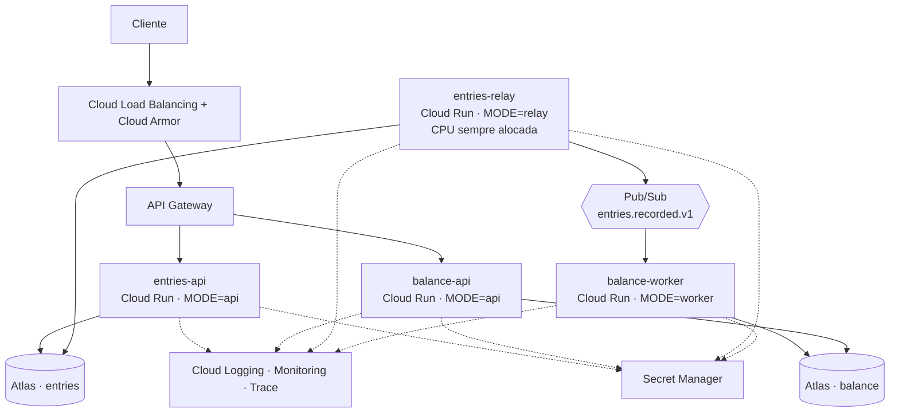
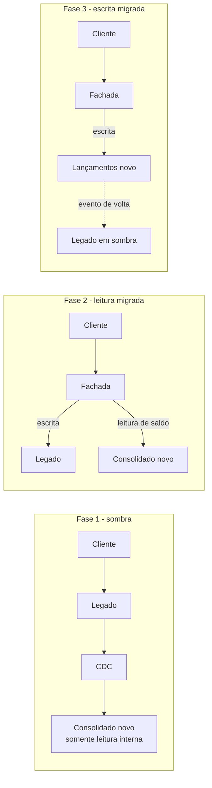

# Decisões e alternativas

## Microsserviços em vez de monolito modular

O enunciado exige que Lançamentos continue de pé com o Consolidado fora. Um monolito modular custa menos para operar e resolveria o caso funcional, com os dois módulos isolados e comunicação interna assíncrona. Só que processo compartilhado significa memória, thread pool e deploy compartilhados. Um vazamento no consolidado derruba o lançamento junto.

Como o limite entre os dois contextos é estável (um produz fato, o outro deriva projeção), o custo de separar é baixo. Separei.

Custo: mais partes móveis, consistência eventual e depuração atravessando processos.

## Integração assíncrona por evento

Chamada síncrona entre os dois serviços está descartada, porque acopla disponibilidade.

Entre as opções assíncronas, avaliei Pub/Sub e Kafka. Fui de Pub/Sub.

O argumento que normalmente salva o Kafka num caso desses é o replay: reprocessar o tópico desde o começo para reconstruir a projeção depois de um bug de cálculo. Aqui ele não se sustenta, porque o log de eventos não é a fonte da verdade. O lançamento é imutável e a coleção `entries` é o livro-razão. Se o saldo corromper, eu reconstruo lendo o ledger, que é o dado que o negócio garante, e não o broker, que é transporte com retenção limitada. Some-se que o Pub/Sub tem retenção configurável no tópico e `seek` por timestamp, o que cobre a janela curta.

O que sobraria a favor do Kafka é ordenação por chave e o ecossistema de conectores. Ordenação eu não preciso: aplicar um delta de saldo é soma, é comutativa, e tem teste provando que a ordem de chegada não muda o resultado. Exportação para BI sai com uma subscription BigQuery do próprio Pub/Sub.

Contra o Kafka pesa o custo e a operação. Cluster mínimo de três brokers, algo em torno de US$ 450 por mês, para um sistema cujo pico é de 50 req/s. No Pub/Sub esse número fica perto de US$ 15, escala a partir de zero e não tem nada para operar. No ambiente local a diferença também aparece: o emulador oficial substitui quinze variáveis de configuração do KRaft no compose.

Kafka entraria em duas situações: a organização já ter o cluster rodando e rateado entre times, ou aparecer um consumidor que precise reler meses de histórico direto do broker. Nenhuma das duas é o caso de um sistema que está nascendo.

De todo modo, a mensageria está atrás de uma porta (`EventPublisher`) e nenhum caso de uso sabe o que tem do outro lado, então a decisão é reversível num único adaptador.

## Transactional Outbox

É o ponto que mais vejo errado em arquitetura orientada a eventos: gravar no banco e publicar no broker em seguida como se fossem uma coisa só. Se o processo morre entre as duas operações, o lançamento existe e o evento nunca sai. O saldo fica errado para sempre e ninguém percebe, porque não há erro em lugar nenhum.

A solução é gravar o evento na mesma transação do lançamento, numa coleção de saída, e ter um relay lendo os pendentes e publicando. Isso reduz "dois sistemas atômicos" para "um sistema atômico mais entrega at-least-once", que o consumidor idempotente resolve.

Alternativas que considerei:

* Change Streams do Mongo: 
latência menor e sem polling, mas acopla a publicação ao formato interno da coleção e adiciona um componente com estado para operar. Vale quando o volume justifica.
* Transação distribuída (2PC): não existe entre Mongo e Pub/Sub, e é frágil onde existe.
* Publicar direto e aceitar o risco: é o que a maioria faz, e é origem de metade dos incidentes de divergência.

Custo: latência do polling, hoje de até 500 ms. O relay entra em modo contínuo quando há backlog, então na prática fica bem abaixo disso.

## Idempotência em três camadas

Cada camada resolve um problema diferente:

1. Na API, com `Idempotency-Key` e índice único. Protege o cliente que fez retry porque a rede caiu depois do commit.
2. No relay. Se o processo morrer entre publicar e marcar como publicado, o evento sai duas vezes. Isso é esperado.
3. No consumidor, gravando o `eventId` na mesma transação do `$inc`. Absorve o item 2 e a re-entrega natural do Pub/Sub, que é at-least-once por definição.

Juntas dão o efeito de "exatamente uma vez" sem precisar de garantia especial da infraestrutura.

## MongoDB

Três razões. O `$inc` atômico no documento é exatamente a operação do consolidado e evita ler-somar-gravar com trava. A transação multi-documento é o que o outbox exige. E é o banco em que eu tenho quilometragem de produção de verdade, incluindo uma migração de Atlas para instância própria, então sei onde ele dói e como ele se comporta sob carga.

Um relacional atenderia bem o lado de lançamentos, onde o dado é rigidamente estruturado, e é a alternativa que eu levaria para a mesa numa discussão de time. Não fui por ali por dois motivos. O primeiro é que Mongo cobre os dois contextos com a mesma tecnologia, e o consolidado, que é a parte com pico de carga, se encaixa melhor no modelo de documento. O segundo é experiência: eu consigo garantir o comportamento do Mongo sob concorrência porque já apanhei dele, e neste projeto isso apareceu na prática (ver a nota sobre chave duplicada em transação, no README). Escolher um banco pelo qual eu não respondo com a mesma segurança seria trocar risco conhecido por risco desconhecido.

Cada serviço tem o seu banco. Compartilhar traria o acoplamento de volta pela porta dos fundos.

## TypeScript, Node e NestJS, com arquitetura hexagonal

A carga é dominada por I/O, que é onde o Node se sai bem, e é o stack em que sou mais produtivo. Java com Spring e Go seriam alternativas naturais, e nenhuma das duas mudaria a arquitetura: o domínio não depende de framework.

O NestJS entra pela injeção de dependência, que é o que torna a arquitetura hexagonal barata. O domínio não importa nada de framework, os casos de uso falam com portas (`EntryRepository`, `BalanceRepository`, `EventPublisher`, `OutboxRepository`) e a infraestrutura implementa. Na prática isso aparece nos testes: a maioria roda contra implementações em memória, em menos de dois segundos, sem Docker.

## Centavos inteiros e data de negócio com fuso

Dinheiro em ponto flutuante é erro básico e aparece em produção o tempo todo. Uso inteiro em centavos da API ao banco. `Decimal128` seria a alternativa, mas inteiro é mais simples e suficiente com uma moeda só. Se entrar câmbio ou rateio com fração, muda.

A data de negócio é calculada no fuso do comerciante e persistida como `YYYY-MM-DD`. Sem isso, toda venda depois das 21h de Brasília cai no dia seguinte do relatório, e o comerciante vai dizer, com razão, que o sistema está errado.

## Nuvem alvo: GCP com Cloud Run

Cloud Run porque o perfil de carga é de pico curto: escala a partir de zero, cobra por requisição e não exige time cuidando de cluster. O mesmo raciocínio que levou ao Pub/Sub. GKE daria mais controle, incluindo escalar o worker pelo tamanho do backlog em vez de por requisição, ao custo de uma operação que esse sistema ainda não justifica.

Os quatro processos são dois artefatos com `MODE` diferente. Relay e worker precisam de CPU sempre alocada, porque são processos de fundo e não são acordados por requisição HTTP. As APIs podem escalar a zero.

GCP é onde eu opero melhor. Na AWS o desenho é o mesmo, com Fargate ou App Runner, SNS/SQS e DocumentDB.

## Arquitetura de transição

Cenário assumido: já existe um sistema legado que registra caixa, provavelmente um monolito com banco relacional, e não dá para trocar tudo de uma vez. Strangler Fig em quatro fases.

Fase 1, sombra. O legado continua sendo a fonte da verdade. Uma captura de mudanças no banco dele publica os lançamentos no mesmo tópico `entries.recorded.v1`. A forma depende do que o legado permite: lendo o log de transações, se houver ferramenta de CDC homologada, ou com trigger gravando numa tabela de saída, que é o mesmo padrão de outbox usado no serviço novo e funciona em qualquer banco. O consolidado novo é alimentado por esses eventos e roda em paralelo, sem ninguém consumir. Um job diário compara o saldo dos dois e reporta divergência. Essa fase não acaba por decisão de calendário, acaba quando a reconciliação zera.

Fase 2, leitura migrada. Entra uma fachada na frente, API Gateway ou o próprio BFF, que roteia as consultas de saldo para o serviço novo e mantém a escrita no legado. Risco baixo e rollback por mudança de rota. A leitura, que é onde está o pico de 50 req/s, sai das costas do legado.

Fase 3, escrita migrada. A fachada passa a rotear a escrita para o serviço novo, um recorte de cada vez (por tipo de operação, por região, por lote de comerciantes). O fluxo de eventos se inverte: o serviço novo publica e um adaptador alimenta o legado, que segue em sombra enquanto os satélites dele (fiscal, relatórios antigos, integrações contábeis) não forem desligados. A chave de idempotência precisa ser estável entre os dois mundos, senão essa fase duplica lançamento.

Fase 4, desligamento. Quando o último consumidor do legado sai, corta-se o CDC e o adaptador reverso. O histórico é carregado uma vez como replay no tópico e o consolidado se reconstrói sozinho, que é o motivo de eu ter escolhido log de eventos em vez de fila.
